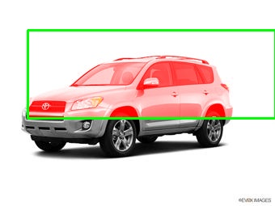
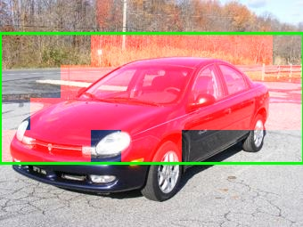
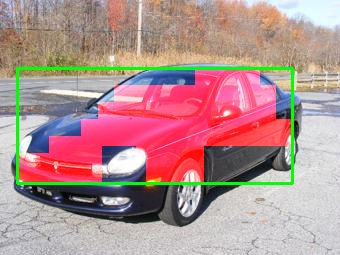
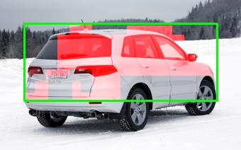

# Deep-Descriptor-Transforming
This is an DDT implementation by pytorch. The paper is ["Deep Descriptor Transforming for Image Co-Localization"](https://www.researchgate.net/publication/316780426_Deep_Descriptor_Transforming_for_Image_Co-Localization).
***
# Results

DDT:
-
<table>
    <tr>
        <td >

</td>
        <td >

</td>
		<td >

</td>
		<td >

</td>
    </tr>
</table>

DDTplus:
-
<table>
    <tr>
        <td >

</td>
        <td >

</td>
		<td >

</td>
		<td >

</td>
    </tr>
</table>
